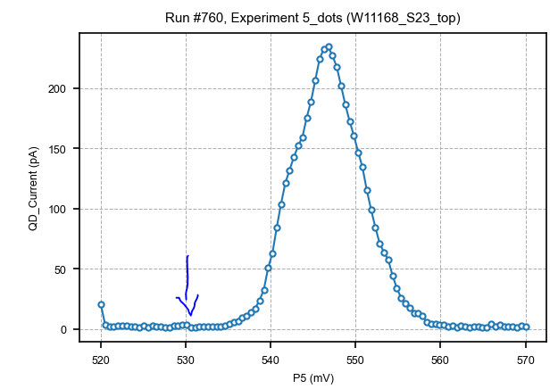
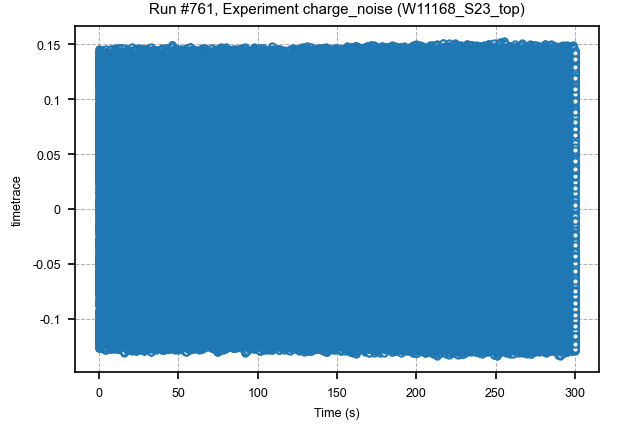
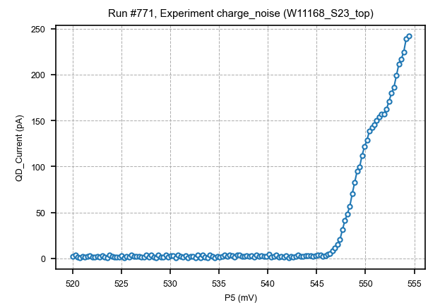
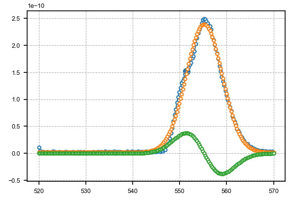
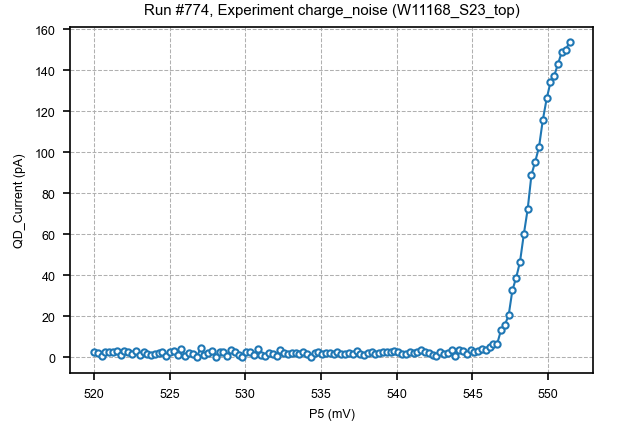
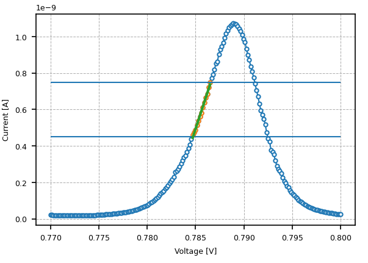
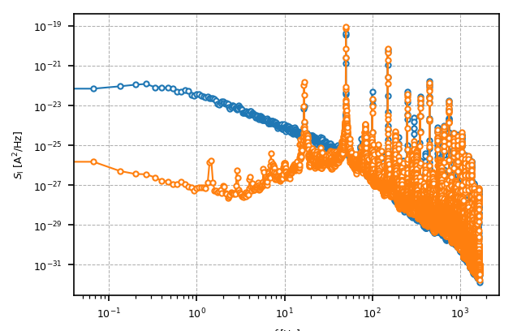
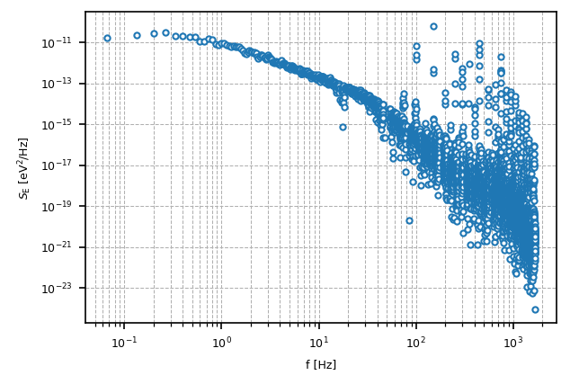
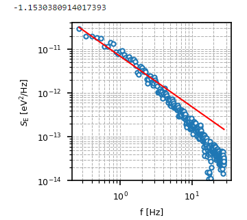

Basic measurements
=====

.. _installation:

1D measurement
------------

.. code-block:: python

  exp = load_or_create_experiment(experiment_name = experiment_name, sample_name = sample_name)

           #gate, ini, end, nb_point, waiting_time, instrument
  data=do1d(V_dot, -1, 1, 20, .1, dmm_CS2_curr , write_period=.1, do_plot=True, 
          measurement_name='link_test', show_progress=True, use_threads=True,)

If you want to fit for the ohmics: 

.. code-block:: python

   dataset=load_by_run_spec(captured_run_id=2)  #put the id of your measurement 
   # plt.figure()
   x=dataset.get_parameter_data()['CS2_current']['QD_Bias']*1e-3  #if you don't know the name run just in a cell dataset 
   y=dataset.get_parameter_data()['CS2_current']['CS2_current']
   m, b = np. polyfit(x, y, 1) 
   print('Resistance: %.2f kOhm' % (1/m*1e-3))
   print(b)
   plt.plot(x*1e3, y*1e9,'.')
   plt.plot(x*1e3, (b+m*x)*1e9)
   plt.xlabel('Bias [mV]')
   plt.ylabel('Current [nA]')
   plt.title('Resistance: %.2f kOhm' % (1/m*1e-3))
      
      
2D measurement
----------------

.. code-block:: python

  exp = load_or_create_experiment(experiment_name = experiment_name, sample_name = sample_name)        
  do2d(P1, x_i,x_f,120, 0.0, P3, y_i, y_f,120, 0.0, 
      dmm_CS1_curr,
      show_progress=True,
      do_plot=True,
      exp=exp,
      measurement_name='5QD',
  )
         
Noise measurement
----------------

from time import sleep

Find a Coulomb peak 

.. code-block:: python

   scanjob = scanjob_t({'sweepdata': dict({'param': station.DAC.dac5,
                                           'start':0.0, 'end':3000.0, 'step':10.0,
                                           'wait_time': 1e-3,
                                           'wait_time_startscan': 10e-3}),
                                           'minstrument': [station.dmm_curr_sensor],
                                           'dataset_label': 'Leak_all_gates_to_ohmics'})

   data1d = qtt.measurements.scans.scan1D(station, scanjob, liveplotwindow= None, location=None, verbose=0)
   plot_nanoqtt(data1d, scanjob)
   #station.DAC.dac5.set(0.0)

Then we measure the current for 5 min in the background ( when the current is 0 or better at the top of the peak where the slope is 0). Then we measure the current on the maximum slope of the peak.

Background 0A
^^^^^^^^^^^^^^^^^^^^^^^^^^^

.. code-block:: python

  # parameter of dmm such as we are able to measure for 5 min
  dmm_dot.autozero('OFF')
  dmm_dot.autorange('OFF')
  dmm_dot.NPLC(0.02)
  dmm_dot.timetrace_dt(0.0003)
  dmm_dot.timetrace_npts(1000000)
  
  # measurement
  P5(530)  # Plunger such as I=0 A 
  time.sleep(1)
  exp = load_or_create_experiment(experiment_name = 'charge_noise', sample_name = sample_name)
  data=do0d(dmm_dot.timetrace, write_period=0.1, do_plot=True,measurement_name='background')

Background top of the peak
^^^^^^^^^^^^^^^^^^^^^^^^^^^

The first option is to repeat the background 0A measurement but fix the plunger to be on the top of the peak. 
Or you can first measure the peak then start a measurement that will stop when the maximum is reach 

.. code-block:: python

  #measure the Coulomb peak 
  V_dot(-1.5)
  dmm_dot.NPLC(1)
  BR(1270.0)
  B45(1200.0)
  
  do1d(P5,520,570,200,0.0,dmm_dot_curr,show_progress=True,do_plot=True,exp=exp,measurement_name='P5_CO',)

.. code-block:: python
  
  dmm_dot.NPLC(1)
  #load the previous dataset to extract the maximum
  dataset=load_by_run_spec(captured_run_id=767)
  Curr=dataset.get_parameter_data()['QD_Current']['QD_Current']
  x=dataset.get_parameter_data()['QD_Current']['P5']
  Peak=np.max(Curr)

  meas = Measurement(name="test", exp=exp)  
  meas.register_parameter(P5)
  meas.register_parameter(dmm_dot_curr, setpoints=(P5,))
  with meas.run() as datasaver:
      #do the plunger sweep as long as I didn't reach the maximum
      for dac_sweep in np.linspace(x[0], x[-1], np.size(x)):
          P5(dac_sweep)
          I=dmm_dot_curr()
          datasaver.add_result((P5, P5()), (dmm_dot_curr, dmm_dot_curr()))
          if np.abs(I-Peak)<1*1e-12:
              break
  print(P5.get())
  dataset = datasaver.dataset
  axs, cbs = plot_dataset(dataset)

Once P is fixed, we can do the noise measurement

.. code-block:: python

  dmm_dot.autozero('OFF')
  dmm_dot.autorange('OFF')
  dmm_dot.NPLC(0.02)
  dmm_dot.timetrace_dt(0.0003)
  dmm_dot.timetrace_npts(1000000)

  time.sleep(1)
  exp = load_or_create_experiment(experiment_name = 'charge_noise', sample_name = sample_name)
  data=do0d(dmm_dot.timetrace, write_period=0.1, do_plot=True,measurement_name='peak') 

On the slope
^^^^^^^^^^^^^^^^^^^^^^^^^^^

One option is the do the same as being on the top of the peak but instead of findind the maximum of the current, you look for the maximum slope. 
For getting the derivative you can use a gaussian fit (probably other methods can work).

Find the max of the derivative

.. code-block:: python
  
  #load a dataset, it is easier if the coulomb peak is centered
  dataset=load_by_run_spec(captured_run_id=773) 
  Curr=dataset.get_parameter_data()['QD_Current']['QD_Current']
  x=dataset.get_parameter_data()['QD_Current']['P5']

  #Fit gauss
  def gaus(x,a,x0,sigma, offset):
      return a*np.exp(-(x-x0)**2/(2*sigma**2)) + offset
  
  mean=555 #(x[-1]+x[0])/2 #you might need to adjust the guess
  sigma=1#(x[-1]-x[0])/5
  
  popt,pcov = curve_fit(gaus,x,Curr,p0=[1,mean,sigma, Curr[0]])
  
  #Derivative
  def deriv_gaus(x,a,x0,sigma, offset):
      b=-(x-x0)/sigma**2
      return a*b*np.exp(-(x-x0)**2/(2*sigma**2))
  
  Deriv=deriv_gaus(x,popt[0],popt[1],popt[2],popt[3])
  
  max_slop=max(Deriv)
  index_slop=np.argmax(Deriv)
  #Check that it makes sense  
  plt.plot(x,Curr,label='Data')
  plt.plot(x,gaus(x,popt[0],popt[1],popt[2],popt[3]),label='Gauss')
  plt.plot(x,deriv_gaus(x,popt[0],popt[1],popt[2],popt[3]),label='Deriv')
  plt.scatter(x[index_slop],Curr[index_slop],s=40)
  plt.legend(loc='best')
  print(max_slop)

Go on the max of the derivative

.. code-block:: python

  meas = Measurement(name="test", exp=exp)

  meas.register_parameter(P5)
  meas.register_parameter(dmm_dot_curr, setpoints=(P5,))
  with meas.run() as datasaver:
  
      for dac_sweep in np.linspace(x[0], x[-1], np.size(x)):
          P5(dac_sweep)
          I=dmm_dot_curr()
          datasaver.add_result((P5, P5()), (dmm_dot_curr, dmm_dot_curr()))
          if np.abs(I-Curr[index_slop])<1*1e-12:
              break
  print(P5.get())
  dataset = datasaver.dataset
  axs, cbs = plot_dataset(dataset)

Do the noise measurement

.. code-block:: python

  dmm_dot.autozero('OFF')
  dmm_dot.autorange('OFF')
  dmm_dot.NPLC(0.02)
  dmm_dot.timetrace_dt(0.0003)
  dmm_dot.timetrace_npts(1000000)
  
  time.sleep(1)
  exp = load_or_create_experiment(experiment_name = 'charge_noise', sample_name = sample_name)
  data=do0d(dmm_dot.timetrace, write_period=0.1, do_plot=True,measurement_name='slope')

Another method is to use a linear fit on a small part of the peak 

.. code-block:: python

  dataset=load_by_run_spec(captured_run_id=296)
  gate=dataset.get_parameter_data('Current')['Current']['PM']*1e-3
  curr=dataset.get_parameter_data('Current')['Current']['Current']
  plt.plot(gate,curr)
  plt.plot(gate[80:95],curr[80:95])  #choose the range 
  plt.plot(762.75e-3,6.25e-10,ms=5,mfc='k',c='k')  #is where you want to measure 
  plt.hlines(7.5e-10,np.min(gate),np.max(gate))
  plt.hlines(5e-10,np.min(gate),np.max(gate))
  #linear fit
  m, b = np.polyfit(gate[80:95],curr[80:95], 1)
  plt.plot(gate[80:95], m*gate[80:95] + b,marker='',lw=2) 
  plt.xlabel('Voltage [V]')
  plt.ylabel('Current [A]')
  
  print(m) #is the slope 

Do the measurement

.. code-block:: python

  mm.autozero('OFF')
  dmm.autorange('OFF')
  dmm.NPLC(0.02)
  dmm.timetrace_dt(0.0003)
  dmm.timetrace_npts(1000000)
  
  BBL(900)
  BBR(700)
  TL(730)
  TR(430)
  bias(-.45)
  PM(762.5)
  time.sleep(1)
  exp = load_or_create_experiment(experiment_name = 'charge_noise', sample_name = '20221007_10721_S67_TQD_cQED_refl')
  data=do0d(dmm.timetrace, write_period=0.1, do_plot=True,measurement_name='timetrace_peak')

Analysis
^^^^^^^^^^^^^^^^^^^^^^^^^^^

You need the slope and the lever arm.

For the power spectral density: 

.. code-block:: python

  dataset=load_by_run_spec(captured_run_id=303) #background
  t=dataset.get_parameter_data('DMM_timetrace')['DMM_timetrace']['DMM_time_axis']
  y=dataset.get_parameter_data('DMM_timetrace')['DMM_timetrace']['DMM_timetrace']*1e-9  #1e-9 is the gain
  f,psd=signal.welch(y,1/0.0003, nperseg=len(y)/20)  #0.0003 come from dt for the dmm
  plt.loglog(f, psd)
  
  dataset=load_by_run_spec(captured_run_id=304) #slope
  tb=dataset.get_parameter_data('DMM_timetrace')['DMM_timetrace']['DMM_time_axis']
  yb=dataset.get_parameter_data('DMM_timetrace')['DMM_timetrace']['DMM_timetrace']*1e-9
  fb,psdb=signal.welch(yb,1/0.0003, nperseg=len(yb)/20)
  plt.loglog(fb, psdb)
  
  plt.xlabel('$f$ [Hz]')
  plt.ylabel('$S_\mathrm{I}$ [A$^2$/Hz]')

Noise:

.. code-block:: python

  # m the slope in A/V and a the lever arm 
  plt.loglog(f, ((psd-psdb)/m**2)*a**2,ls='')
  #plt.grid(which='minor',axis='x')
  plt.grid(True, which="both")
  plt.xlabel('f [Hz]')
  plt.ylabel(r'$S_\mathrm{E}$ [eV$^2$/Hz]')

Fit:

.. code-block:: python

  plt.figure(figsize=(2,2))
  psdf=(psd-psdb)/m/m*0.09*0.09
  plt.loglog(f[4:420], psdf[4:420],ls='')
  #plt.grid(which='minor',axis='x')
  plt.grid(True, which="both")
  plt.xlabel('f [Hz]')
  plt.ylabel(r'$S_\mathrm{E}$ [eV$^2$/Hz]')
  #plt.xlim(1e-1,1e1)
  plt.ylim(1e-14,8e-11)
  
  from scipy.optimize import curve_fit
  
  def myExpFunc(x, a, b):
      return a * np.power(x, b)
  popt, pcov = curve_fit(myExpFunc, f[4:420], psdf[4:420],p0=[1e-7,-1.2])
  plt.plot(f[4:420], myExpFunc(f[4:420], *popt), 'r-', 
           label="({0:.3f}*x**{1:.3f})".format(*popt))
  print(popt[1])

   

  
      
