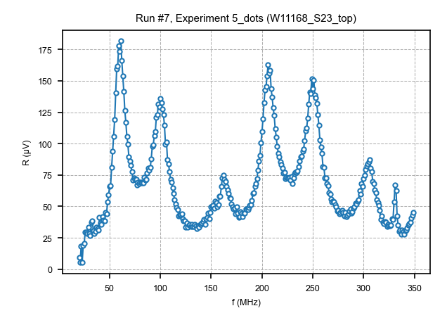
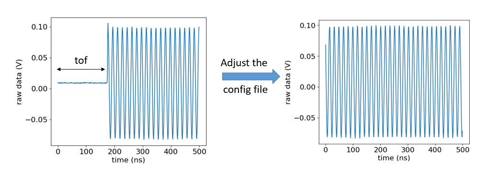

OPX
=====

.. _installation:

Documentation
------------

Qua documentation: https://docs.quantum-machines.co/1.1.5/

Configuration: https://docs.quantum-machines.co/1.1.5/assets/qua_config.html

QM github: https://github.com/qua-platform

Qcodes driver: https://github.com/qua-platform/py-qua-tools/tree/main/qualang_tools/external_frameworks/qcodes

Connexion
------------

.. code-block:: python

   from qm.qua import *
   from qualang_tools.external_frameworks.qcodes.opx_driver import OPX
   from configuration import *
   opx_instrument = OPX(config, name="OPX_demo", host='10.21.42.178')
   #station.add_component(opx_instrument) # if you want to use it with qcodes
   #opx_instrument.readout_pulse_length(config['pulses']['measure']['length']) 

Programm
------------
**Example execution of a program**

.. code-block:: python  

   qm=opx_instrument.qm # Open a quantum machine with a given configuration ready to execute a program
   job = qm.execute(prog)

   #if your programm has a infinite loop: stop the program after x times
   time.sleep(30)  # The program will run for 30 seconds
   job.halt()

**Example of a program**

.. code-block:: python 

      gate1='P1'  #P1 and P2 are elements of the OPX defined in the config file 
      gate2='P2'
      
      with program() as prog:
          with infinite_loop_():
              for i in range(0,nb_period):
                  play('jump'*amp(1),gate1,duration=(period_pulse/2)//4)
                  play('jump'*amp(1),gate2,duration=(period_pulse/2)//4)
                  play('jump'*amp(-1),gate1,duration=(period_pulse/2)//4)
                  play('jump'*amp(-1),gate2,duration=(period_pulse/2)//4)

      opx_instrument.qua_program = prog

**Example of a simulation**

.. code-block:: python 

   opx_instrument.qua_program = prog

   # Simulate program
   opx_instrument.sim_time(20_000)
   opx_instrument.simulate()
   opx_instrument.plot_simulated_wf()

.. image:: image/ex_opx_simulation.PNG
   :width: 100px
   :height: 50px
   :scale: 40 %
   :alt: alternate text
   :align: right

      
Qcodes measurement
----------------
If you want to do sweep other parameter than opx via qcode, you need first to create a function that return the qua program and then do the qcodes measurement. The qcodes measurement change the sweeping parameter, run the qua program inner the infinite loop, break it at the pause then change again the external parameter,...

OD QUA
^^^^^^^^^^^^^^^^^^^^^^^^^^^

If you don't want to sweep an OPX parameter
Example for reflectometry measurement
First we define the program

.. code-block:: python

   def OPX_0d_scan(f,simulate=False):
       with program() as prog:
           update_frequency('RF', f)
           I = declare(fixed)
           Q = declare(fixed)
           Q_st = declare_stream()
           I_st = declare_stream()
           with infinite_loop_():
               if not simulate:
                   pause()  # to synchronize the opx measurement with the external parameter, skip the pause in the resume function in the dond
               measure(
                   "measure"*amp(2),
                   "RF",
                   None,  # don't save raw data
                   demod.full("cos", I, "out1"),
                   demod.full("sin", Q, "out1"),
               )
               save(I, I_st)
               save(Q, Q_st)
   
           with stream_processing():
               I_st.save_all("I")
               Q_st.save_all("Q")
    return prog

Then we do the measurement, it can be a 1d or 2d measurement

.. code-block:: python

   opx_instrument.qua_program = OPX_0d_scan(f,simulate=False)
   do1d(CS1_BL,1200,2200,10,0.1,
       opx_instrument.resume,
       opx_instrument.get_measurement_parameter(),
       dmm_CS1_curr,
       enter_actions=[opx_instrument.run_exp],
       exit_actions=[opx_instrument.halt],
       show_progress=True,
       do_plot=True,
       exp=exp,
       measurement_name='CS1_BL_opx',
   )

That will give you I,Q, R and Phase

1D QUA
^^^^^^^^^^^^^^^^^^^^^^^^^^^

If you want to sweep an OPX parameter.
Example for a frequency sweep

.. code-block:: python

   from qualang_tools.loops import from_array
   # QUA sequence
   def OPX_frequency_sweep(f_array,n_avg=50,simulate=False): 
       with program() as prog:
           #adc_st=declare_stream(adc_trace=True)
           n = declare(int)
           f = declare(int)
           I = declare(fixed)
           Q = declare(fixed)
           I_st = declare_stream()
           Q_st = declare_stream()
           with infinite_loop_():
               if not simulate:
                   pause()
               with for_(n, 0, n < n_avg, n + 1):
                   with for_(*from_array(f,f_array)):
                       reset_phase('RF')
                       update_frequency('RF', f)
                       #measure('measure'*amp(self.amp()), 'RF', adc_st, demod.full('cos', I, 'out1'), demod.full('sin', Q, 'out1'))
                       measure('measure'*amp(0.2), 'RF', None, demod.full('cos', I, 'out1'), demod.full('sin', Q, 'out1'))
   
                       save(I, I_st)
                       save(Q, Q_st)
                       wait(100)
   
           with stream_processing():
               I_st.buffer(len(f_array)).buffer(n_avg).map(FUNCTIONS.average()).save_all(
                   "I"
               )
               Q_st.buffer(len(f_array)).buffer(n_avg).map(FUNCTIONS.average()).save_all(
                   "Q"
               )
   
       return prog

.. code-block:: python

   f_array=np.arange(20e6,200e6,1e6)
   opx_instrument.set_sweep_parameters("axis1", f_array, "Hz", "f")  #the axis the you want the sweep 
   opx_instrument.qua_program = OPX_frequency_sweep(f_array,n_avg=50,simulate=False)

   exp = load_or_create_experiment(experiment_name = experiment_name, sample_name = sample_name)
   do0d(
       opx_instrument.run_exp,
       opx_instrument.resume,
       opx_instrument.get_measurement_parameter(),
       opx_instrument.halt,
       do_plot=True,
       exp=exp,
   )
That will give you I,Q, R and Phase

Calibration
----------------

Time of flight
^^^^^^^^^^^^^^^^^^^^^^^^^^^

You need to calibrate the time of flight i.e. the time that the signal need to reach back the opx. 
For that you will need to send a wave and measure it, look at the raw data the see from wich time you start seing the oscillation. 

Example (probably not the most straight forward):

.. code-block:: python

   #define dummy parameter to be able to use qcodes function

   from qcodes import Parameter
   class MyCounter(Parameter):
       def __init__(self, name, label):
           # only name is required
           super().__init__(
               name=name,
               label=label,
               unit="V",
               docstring="Dummy counter for scanning a variable with qcodes",
           )
           self._count = 0
   
       # you must provide a get method, a set method, or both.
       def get_raw(self):
           self._count += 1
           return self._count
   
       def set_raw(self, val):
           self._count = val
           return self._count
   
   VP1 = MyCounter("counter1", "Vp1")

.. code-block:: python

   #Measurement
   sample_name = 'W11168_S23_top'
   exp_name = '5_dots'
   run = "1d"
   exp = load_or_create_experiment(
       experiment_name=exp_name, sample_name=sample_name
   )
   with program() as prog:
       adc_st = declare_stream(adc_trace=True)
       with infinite_loop_():
           pause()
           wait(200 // 4, "RF")
           measure("measure", "RF", adc_st)
   
       with stream_processing():
           adc_st.input1().save_all("adc1")
   
   # Execute program
   opx_instrument.qua_program = prog
   do1d(VP1,10,20,2,0.1,
       opx_instrument.resume,
       opx_instrument.get_measurement_parameter(),
       enter_actions=[opx_instrument.run_exp],
       exit_actions=[opx_instrument.halt],
       show_progress=True,
       do_plot=True,
       exp=exp,
   )

Plot in an nicer way

.. code-block:: python
   dataset=load_by_run_spec(captured_run_id=15)
   x=dataset.get_parameter_data()['adc1']['counter1']
   y=dataset.get_parameter_data()['adc1']['axis2']
   z=dataset.get_parameter_data()['adc1']['adc1']
   
   time=y[0]
   raw=z[0]
   
   plt.plot(time[:500],raw[:500]) #adjust to see what you want
   plt.xlabel('time (ns)')
   plt.ylabel('raw data (V)')

I tried that but it doesn't work (don't finished)

.. code-block:: python

   def OPX_0d_scan(f,simulate=False):
    with program() as prog:
        update_frequency('RF', f)
        I = declare(fixed)
        Q = declare(fixed)
        Q_st = declare_stream()
        I_st = declare_stream()
        adc_st=declare_stream(adc_trace=True)
        with infinite_loop_():
            if not simulate:
                pause()  # to synchronize the opx measurement with the external parameter, skip the pause in the resume function in the dond
            measure(
                "measure"*amp(2),
                "RF",
                adc_st,  #  save raw data
                demod.full("cos", I, "out1"),
                demod.full("sin", Q, "out1"),
            )
            save(I, I_st)
            save(Q, Q_st)

        with stream_processing():
            I_st.save_all("I")
            Q_st.save_all("Q")
            adc_st.input1().save('adc')
    return prog

   qm=opx_instrument.qm
   prog=OPX_0d_scan(50e6,simulate=False)
   job = qm.execute(prog)
   res = job.result_handles
   res.wait_for_all_values()
   # Plot the results
   fig, (ax1, ax2) = plt.subplots(1, 2)
   fig.suptitle("Inputs from down conversion 1")
   adc_1 = res.get('adc').fetch_all()/2**12
   ax1.plot(adc_1, label="Input 1")
   ax1.set_xlabel("Time [ns]")
   ax1.set_ylabel("Signal amplitude [V]")

Other commands
----------------

Queue
^^^^^^^^^^^^^^^^^^^^^^^^^^^
It case the job won't start and the error is about the queue
you can check if a job is in the queue and delete it (not always work)
https://docs.quantum-machines.co/1.1.5/qm-qua-sdk/docs/API_references/queue/

.. code-block:: python

   qm=opx_instrument.qm
   qm.queue.count
   qm.queue.get
   qm.queue.remove_by_position(1)
   qm.queue.clear

   

  
      
