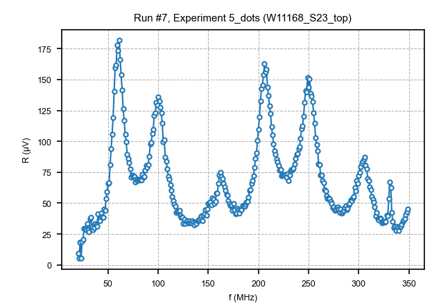
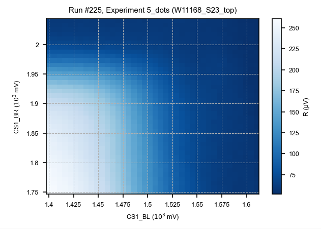
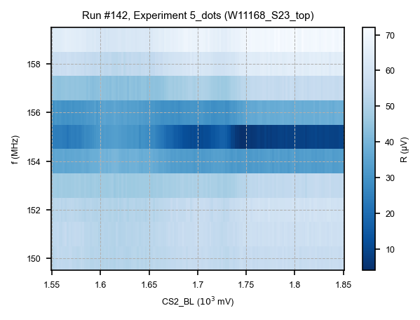
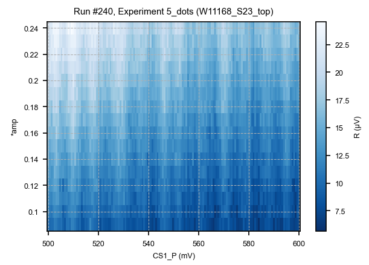
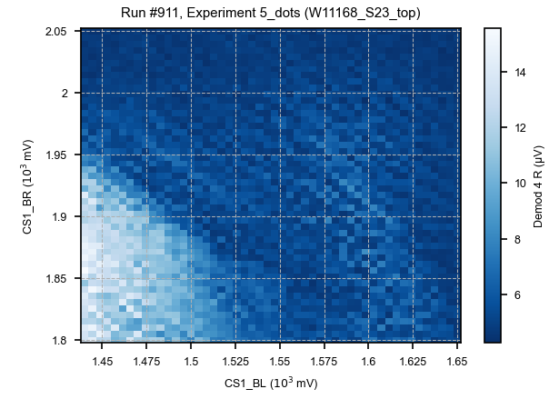
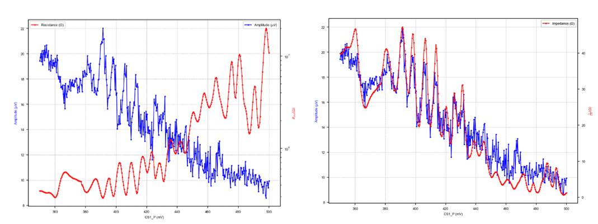

Reflectometry
=====

.. _installation:

Documentation
------------

Demodulation: https://docs.quantum-machines.co/1.1.5/qm-qua-sdk/docs/Guides/demod/?h=demo

Fast scan: https://github.com/qua-platform/qua-libs/tree/main/Quantum-Control-Applications/Quantum-Dots/Use%20Case%201%20-%20Fast%202D%20Scans

https://github.com/qua-platform/py-qua-tools/tree/main/examples/Qcodes_drivers/stability-diagram

Simulation
------------

.. code-block:: python

   # Add the custom sequence to the OPX
   opx_instrument.qua_program = OPX_0d_scan_avg_amp(f,n_avg,ampli=0.1,simulate=True)
   # Simulate program
   opx_instrument.sim_time(10_000)
   opx_instrument.simulate()
   opx_instrument.plot_simulated_wf()

Frequency scan
------------

First, we define the QUA program in a function, the opx will change the frequency and measure, repeat n_avg time and average. Here a factor is applied to the amplitude of the measurement pulse ( *amp(0.2)) in the function but you can also make it an argument of the function. 

.. code-block:: python

   from qualang_tools.loops import from_array
   # QUA sequence
   def OPX_frequency_sweep(f_array,n_avg=50,simulate=False): 
       with program() as prog:
           #adc_st=declare_stream(adc_trace=True)
           n = declare(int)
           f = declare(int)
           I = declare(fixed)
           Q = declare(fixed)
           I_st = declare_stream()
           Q_st = declare_stream()
           with infinite_loop_():
               if not simulate:
                   pause()
               with for_(n, 0, n < n_avg, n + 1):
                   with for_(*from_array(f,f_array)):
                       reset_phase('RF')
                       update_frequency('RF', f)
                       #measure('measure'*amp(0.2), 'RF', adc_st, demod.full('cos', I, 'out1'), demod.full('sin', Q, 'out1'))
                       measure('measure'*amp(0.2), 'RF', None, demod.full('cos', I, 'out1'), demod.full('sin', Q, 'out1'))
   
                       save(I, I_st)
                       save(Q, Q_st)
                       wait(100)
   
           with stream_processing():
               I_st.buffer(len(f_array)).buffer(n_avg).map(FUNCTIONS.average()).save_all(
                   "I"
               )
               Q_st.buffer(len(f_array)).buffer(n_avg).map(FUNCTIONS.average()).save_all(
                   "Q"
               )
   
       return prog

Then you define your frequency range and the step and do the 0d qcodes measurement: 

.. code-block:: python

   f_array=np.arange(20e6,200e6,1e6)
   opx_instrument.set_sweep_parameters("axis1", f_array, "Hz", "f")  #the axis the you want the sweep 
   opx_instrument.qua_program = OPX_frequency_sweep(f_array,n_avg=50,simulate=False)

   exp = load_or_create_experiment(experiment_name = experiment_name, sample_name = sample_name)
   do0d(
       opx_instrument.run_exp,
       opx_instrument.resume,
       opx_instrument.get_measurement_parameter(),
       opx_instrument.halt,
       do_plot=True,
       exp=exp,
   )
That will give you I,Q, R and Phase

1D or 2D measurement
------------

You define the qua program that measures. Here the number of average and the factor of the amplitude of the wave are arguments of the function because it is useful for the optimisation

.. code-block:: python  

   def OPX_0d_scan_avg_amp(f,n_avg,ampli=1,simulate=False):
       with program() as prog:
           n = declare(int)
           I = declare(fixed)
           Q = declare(fixed)
           Q_st = declare_stream()
           I_st = declare_stream()
           with infinite_loop_():
               update_frequency('RF', f)
   
               if not simulate:
                   pause() # to synchronize the opx measurement with the external parameter, skip the pause in the resume function in the dond
               
               with for_(n, 0, n < n_avg, n + 1):
                   measure(
                       "measure"*amp(ampli),
                       "RF",
                       None,  # don't save raw data
                       demod.full("cos", I, "out1"),
                       demod.full("sin", Q, "out1"),
                   )
                   save(I, I_st)
                   save(Q, Q_st)
   
           with stream_processing():
               I_st.buffer(n_avg).map(FUNCTIONS.average()).save_all("I")
               Q_st.buffer(n_avg).map(FUNCTIONS.average()).save_all("Q")
       return prog

Then you run the 1D or 2D qcodes measurement. Here we also measure with a DMM, so you will get I,Q,R,Phase and current

.. code-block:: python  

   opx_instrument.qua_program = OPX_0d_scan_avg_amp(f,50,2,simulate=False)
   do2d(
       CS1_BL, 1400, 1610,40, 0, CS1_BR, 1750,2040,40, 0, 
       opx_instrument.resume,
       opx_instrument.get_measurement_parameter(),
       dmm_CS1_curr,
       enter_actions=[opx_instrument.run_exp],
       exit_actions=[opx_instrument.halt],
       show_progress=True,
       do_plot=True,
       exp=exp,
       measurement_name='CS1_BL_BR_opx',
   )

      
Optimization
----------------
You might need to fine-tune the amplitude and the frequency of the wave. For that, choose a range of gate voltage where you see a coulomb oscillation or at least the edge of a corner plot. Do a 2D plot by sweeping the gate and an OPX parameter

Frequency
^^^^^^^^^^^^^^^^^^^^^^^^^^^

QUA program 

.. code-block:: python

   from qualang_tools.loops import from_array
   # QUA sequence
   def OPX_frequency_sweep_amp(f_array,n_avg=50,ampli=1,simulate=False): 
       with program() as prog:
           #adc_st=declare_stream(adc_trace=True)
           n = declare(int)
           f = declare(int)
           I = declare(fixed)
           Q = declare(fixed)
           I_st = declare_stream()
           Q_st = declare_stream()
           with infinite_loop_():
               if not simulate:
                   pause()
               with for_(n, 0, n < n_avg, n + 1):
                   with for_(*from_array(f,f_array)):
                       reset_phase('RF')
                       update_frequency('RF', f)
                       #measure('measure'*amp(self.amp()), 'RF', adc_st, demod.full('cos', I, 'out1'), demod.full('sin', Q, 'out1'))
                       measure('measure'*amp(ampli), 'RF', None, demod.full('cos', I, 'out1'), demod.full('sin', Q, 'out1'))
   
                       save(I, I_st)
                       save(Q, Q_st)
                       wait(100)
   
           with stream_processing():
               I_st.buffer(len(f_array)).buffer(n_avg).map(FUNCTIONS.average()).save_all(
                   "I"
               )
               Q_st.buffer(len(f_array)).buffer(n_avg).map(FUNCTIONS.average()).save_all(
                   "Q"
               )
   
       return prog

Measurement

.. code-block:: python

   f_array=np.arange(150e6,160e6,1e6)
   opx_instrument.set_sweep_parameters("axis1", f_array, "Hz", "f")
   
   opx_instrument.qua_program = OPX_frequency_sweep_amp(f_array,n_avg=50,ampli=3,simulate=False)
   
   exp = load_or_create_experiment(experiment_name = experiment_name, sample_name = sample_name)
   do1d(CS2_BL,1550.0,1850.0,150,0.0,
       dmm_CS2_curr,
       opx_instrument.run_exp,
       opx_instrument.resume,
       opx_instrument.get_measurement_parameter(),
       opx_instrument.halt,
       do_plot=True,
       exp=exp,
   )

Amplitude
^^^^^^^^^^^^^^^^^^^^^^^^^^^

QUA program

.. code-block:: python

   from qualang_tools.loops import from_array
   # QUA sequence
   def OPX_amplitude_sweep(amp_array,n_avg=50,simulate=False): 
       with program() as prog:
           #adc_st=declare_stream(adc_trace=True)
           n = declare(int)
           ampli = declare(fixed)
           I = declare(fixed)
           Q = declare(fixed)
           I_st = declare_stream()
           Q_st = declare_stream()
           with infinite_loop_():
               if not simulate:
                   pause()
               with for_(n, 0, n < n_avg, n + 1):
                   with for_(*from_array(ampli,amp_array)):
   
                       #measure('measure'*amp(self.amp()), 'RF', adc_st, demod.full('cos', I, 'out1'), demod.full('sin', Q, 'out1'))
                       measure('measure'*amp(ampli), 'RF', None, demod.full('cos', I, 'out1'), demod.full('sin', Q, 'out1'))
   
                       save(I, I_st)
                       save(Q, Q_st)
                       wait(100)
   
           with stream_processing():
               I_st.buffer(len(amp_array)).buffer(n_avg).map(FUNCTIONS.average()).save_all(
                   "I"
               )
               Q_st.buffer(len(amp_array)).buffer(n_avg).map(FUNCTIONS.average()).save_all(
                   "Q"
               )
   
       return prog

Measurement

.. code-block:: python

   f=59e6
   n_avg=50
   amp_array=np.arange(0.09,0.25,0.01)  
   opx_instrument.set_sweep_parameters("axis1", amp_array, "", "*amp")
   
   opx_instrument.qua_program= OPX_amplitude_sweep(amp_array,n_avg=50,simulate=False)
   
   do1d(CS1_P,500,600,150,0.0,
       opx_instrument.resume,
       opx_instrument.get_measurement_parameter(),
       dmm_CS1_curr,
       enter_actions=[opx_instrument.run_exp],
       exit_actions=[opx_instrument.halt],
       show_progress=True,
       do_plot=True,
       exp=exp,
       measurement_name='CS1_CO',
   )

UHFLI
----------------
The UHFLI acts like a dmm to do the measurement

.. code-block:: python
   
    do2d(CS1_BL,1440,1650,50,0,CS1_BR,1800,2050,50,0, 
    dmm_CS1_curr,digitizer.demod4_R,
    show_progress=True,
    do_plot=True,
    exp=exp,
    measurement_name='CS1_corner',
   )

Command

.. code-block:: python

   station.digitizer.demod4_R   #amplitude
   station.digitizer.demod4_phi  #phase
   station.digitizer.oscillator1_freq  #frequency
   station.digitizer.signal_output1_amplitude

Impedance
----------------
If you want to know how close you are to matching you need to calculate the impedance. 

.. code-block:: python

   #get your Coulomb oscillation data
   dataset=load_by_run_spec(captured_run_id=274)
   x=dataset.get_parameter_data()['CS1_current']['CS1_P']
   R=dataset.get_parameter_data()['R']['R']
   Curr=dataset.get_parameter_data()['CS1_current']['CS1_current']
   
   # Values from setup/ measurement    
   R_series = 932.7e3 + 20e3 + 10e3  # Card + PCB
   V_electronics = (0.5 + 0.25)*0.001 # including offset and in volts
   R_dot = (V_electronics/(Curr+1e-12))-R_series   #1e-12 comes from something
   
   plt.figure()
   #Resistance of the dot
   fig, ax1 = plt.subplots(figsize=(8,6))
   ax1.plot(x, R*10**6, 'b.-', label=r'Amplitude ($\mu V$)')  #check unit
   ax2 = ax1.twinx()
   ax2.semilogy(x, R_dot, 'r.-', label=r'Resistance ($\Omega$)')
   #ax1.get_shared_x_axes().join(ax1, ax2)
   ax1.set_xlabel('CS1_P (mV)')
   ax1.set_ylabel('Amplitude ($\mu V$)', color='b')
   ax2.set_ylabel(r'$R_{dot} (\Omega)$', color='r')
   plt.grid()
   ax1.legend()
   ax2.legend()
   
   print('The min. of resistance is {} Kohm'.format(np.min(R/1e3)))
   
   #Impedance
   res_freq = 59e6 #Hz the one that you have
   L = 10e-6 #H on the PCB
   C = 1/(4*(np.pi**2)*L*res_freq**2)
   print('Parasitic capacitance is {} pF'.format(C*10**12))
   Z = L/(C*R_dot)
   
   plt.figure()
   fig, ax1 = plt.subplots(figsize=(8,6))
   ax1.plot(x, R*10**6, 'b.-', label=r'Amplitude ($\mu V$)')
   ax2 = ax1.twinx()
   ax2.plot(x, Z, 'r.-', label=r'Impedance ($\Omega$)')
   #ax1.get_shared_x_axes().join(ax1, ax2)
   ax1.set_xlabel('CS1_P (mV)')
   ax1.set_ylabel('Amplitude ($\mu V$)', color='b')
   ax2.set_ylabel(r'$\frac{L}{CR} (\Omega)$', color='r')
    plt.grid()  
   ax1.legend()
   ax2.legend()

   

  
      
